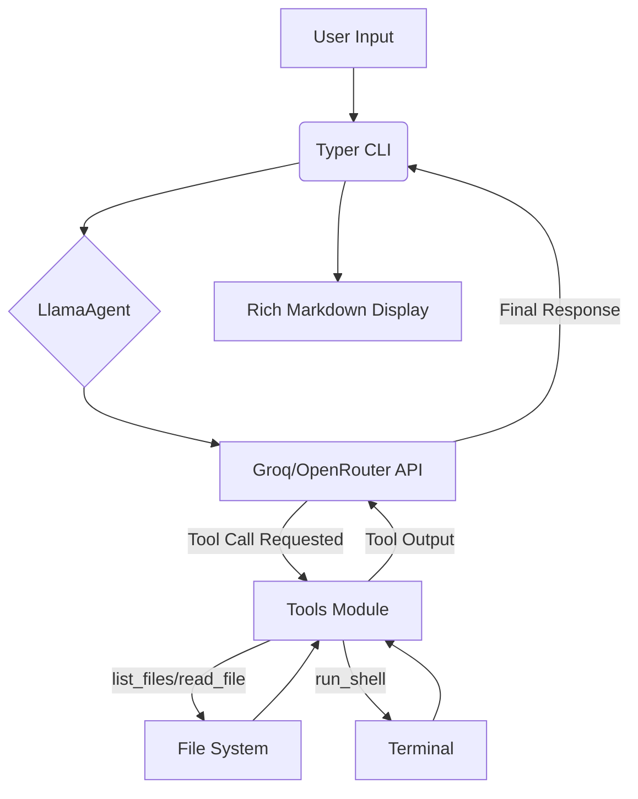

# 🦙 Llama-Agent CLI

**A high-performance, agentic AI coding assistant powered by Meta's Llama models.**

Llama-Agent is a command-line interface (CLI) tool designed to bring the power of "agentic" AI to your local development environment. Unlike simple chatbots, Llama-Agent can **interact with your file system**, **read code**, and **execute shell commands** (with permission), making it a versatile companion for debugging, refactoring, and automation.

---

## 🚀 Key Features

- **Agentic Workflow:** Utilizes OpenAI-compatible "Tool Calling" to allow the model to decide when to list files, read content, or run commands.
- **Extreme Speed:** Integrated with **Groq's LPU™ inference engine** for near-instantaneous (200+ tokens/sec) responses.
- **Provider Agnostic:** Supports **Groq** for speed and **OpenRouter** for access to massive models like Llama 3.1 405B.
- **Context-Aware:** Maintains full conversation history, allowing for complex multi-step tasks.
- **Secure by Design:** (Configurable) "Safety Mode" to prompt for user approval before executing any shell commands.

---

## 🏗️ Architecture



---

## 🛠️ Tech Stack

- **Language:** Python 3.10+
- **CLI Framework:** [Typer](https://typer.tiangolo.com/) & [Rich](https://rich.readthedocs.io/)
- **AI Models:** Meta Llama 3.1 (8B, 70B, 405B)
- **API Clients:** OpenAI Python Library (compatible with Groq/OpenRouter)
- **Environment Management:** `python-dotenv`

---

## 📦 Installation

1. **Clone the repository:**
   ```bash
   git clone https://github.com/yourusername/llama-agent.git
   cd llama-agent
   ```

2. **Set up a virtual environment:**
   ```bash
   python -m venv venv
   source venv/bin/activate  # On Windows: venv\Scripts\activate
   ```

3. **Install dependencies:**
   ```bash
   pip install -r requirements.txt
   ```

4. **Configure your environment:**
   Copy the example environment file and add your API keys.
   ```bash
   cp .env.example .env
   ```
   *Edit `.env` and add your `GROQ_API_KEY` or `OPENROUTER_API_KEY`.*

---

## 📖 Usage

Start the interactive session:
```bash
python main.py start
```

### Example Commands:
- *"List the files in this directory and tell me what the project does."*
- *"Read `agent.py` and suggest three ways to improve its error handling."*
- *"Run `pip list` and check if I have `numpy` installed."*

---

## 🧠 Why I Built This

I built Llama-Agent to explore the intersection of **low-latency inference** and **autonomous agents**. While tools like Claude Code and Aider exist, Llama-Agent provides a lightweight, fully customizable alternative that leverages the incredible speed of Groq.

This project demonstrates:
1. **Tool Integration:** Implementing functional tool-calling logic using LLM JSON schemas.
2. **Resilient AI UX:** Managing long-running context windows and providing real-time status indicators.
3. **Security-First Automation:** Implementing user-in-the-loop validation for high-risk system actions.

---

## 📄 License
MIT
